# Analisis Report

# Table of contents 

- [Analisis Report](#analisis-report)
- [Table of contents](#table-of-contents)
- [1 - Reminder of the need and success criteria](#1---reminder-of-the-need-and-success-criteria)
  - [1.1 - Specifications](#11---specifications)
  - [1.2 - Criteria for success](#12---criteria-for-success)
- [2 - Model of the business domain : UML model of the manipulated notions, relations and explanations](#2---model-of-the-business-domain--uml-model-of-the-manipulated-notions-relations-and-explanations)
  - [2.1 - Use case diagram](#21---use-case-diagram)
  - [2.2 - Diagrame de Séquence Système](#22---diagrame-de-séquence-système)
    - [2.2.1 - Manage photos](#221---manage-photos)
    - [2.2.2 - Extraire\_Posts](#222---extraire_posts)
    - [2.2.3 - Filtrage des posts](#223---filtrage-des-posts)
    - [2.2.4 - Sequence Supprimer post](#224---sequence-supprimer-post)
    - [2.2.5 - Change Filtre Diffusion](#225---change-filtre-diffusion)
    - [2.2.6 - Set-up RaspberryPi](#226---set-up-raspberrypi)
  - [2.3 - User Story](#23---user-story)
    - [2.3.1 - Manage photos](#231---manage-photos)
    - [2.3.2 - Extraire Posts](#232---extraire-posts)
    - [2.3.3 - Filtrage des posts](#233---filtrage-des-posts)
    - [2.3.4 - Sequence Supprimer post](#234---sequence-supprimer-post)
    - [2.3.5 - Change Filtre Diffusion](#235---change-filtre-diffusion)
    - [2.3.6 - Set-up RaspberryPi](#236---set-up-raspberrypi)
- [3 - Description of the ecosystem: presentation of the elements with which the system will have to integrate, the constraints to be respected](#3---description-of-the-ecosystem-presentation-of-the-elements-with-which-the-system-will-have-to-integrate-the-constraints-to-be-respected)
- [4 - Principe de solution : description externe de la solution proposée (le quoi, pas le comment)](#4---principe-de-solution--description-externe-de-la-solution-proposée-le-quoi-pas-le-comment)

<br/>

# 1 - Reminder of the need and success criteria

## 1.1 - Specifications

- Slideshow on interval of predefined images
- Configurable : 
  - Blacklist
  - Whitelist
  - Date range
  - Number monitor
  - Allow image, sound video, video, audio (pay attention to the volume of the audio and the relevance of its broadcast)
  - Do not necessarily broadcast the same content on all screens (random parameter), provided you have enough visual material.
- Automatic moderation but also possibility to intervene in second time to moderate manually, apply spam filtering (to avoid ambiguity of words, filter useless content and fake conferences, impersonating people to make them pay) Filtering by keywords/hastags/dates. 
- Have a nice visualization. Avoid showing too few images too often and avoid redundancy. At the beginning of the conference, if there is not enough visual material, possibility to take posts on social networks before the conference (announcement of participants, reminders of themes).
- Collect content according to given query and sources, for instance: LinkedIn, Instagram, Facebook/Meta, Twitter). 
 
**Bonus**: If the conference is over several days, possibility for the official photographer to broadcast the images taken the day before on the screens. 
## 1.2 - Criteria for success

- La specification est completement effectuée
- La deadline est respectée
- Le software fonctionne correctement (pas de bogues)
- Les critères de test sont validés

<br/>

# 2 - Model of the business domain : UML model of the manipulated notions, relations and explanations

## 2.1 - Use case diagram

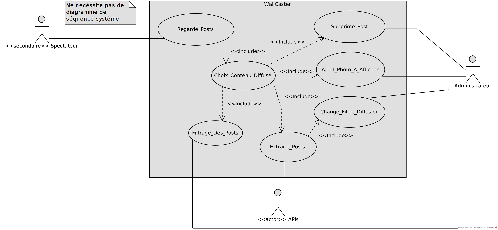

> This is the use case diagram. It shows what each actor are doing on the system. There are 3 actors, 2 primary and one secondary. The primarys are the administrator and the APIs. And the secondary are the spectator.

## 2.2 - Diagrame de Séquence Système

### 2.2.1 - Manage photos

> The sequence system diagrams show several cases of management of the photos on the system.

<br/>

- Scenario Nominatif

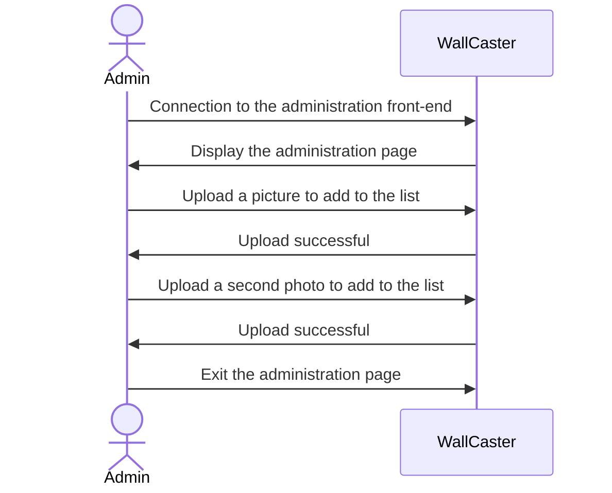

<br/>

- Alternative scenario

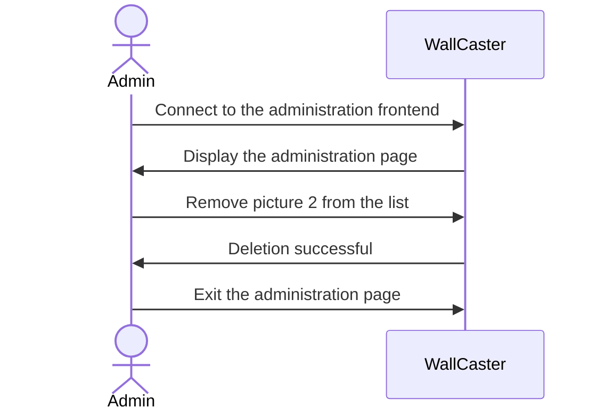
<br/>

- Scenario exception : Photo to large


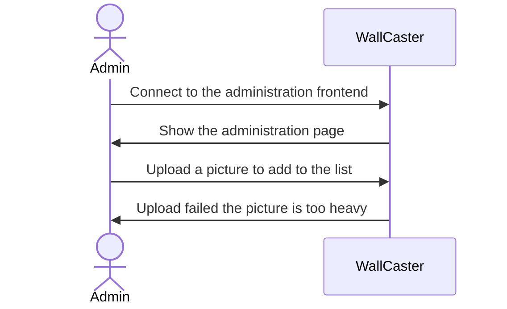

<br/>

- Scenario exception : connection error

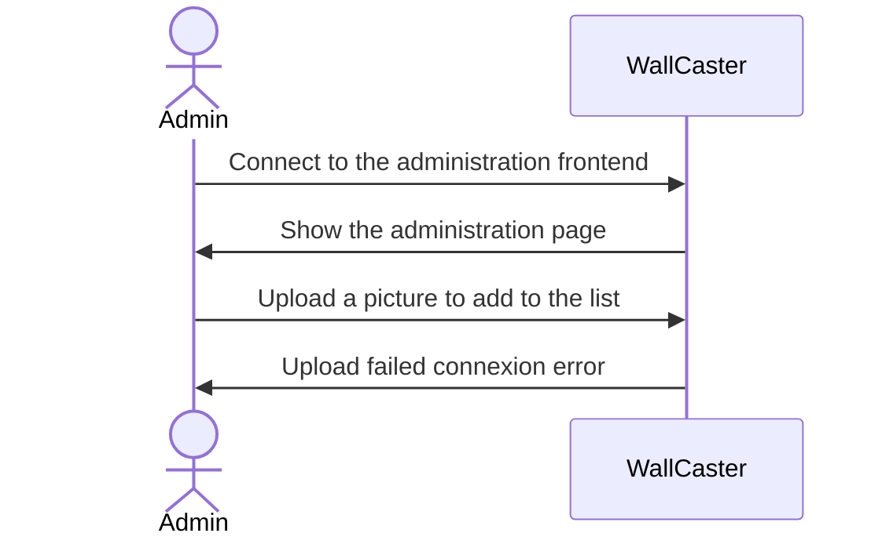

<br/>

- Scenario exception : not found

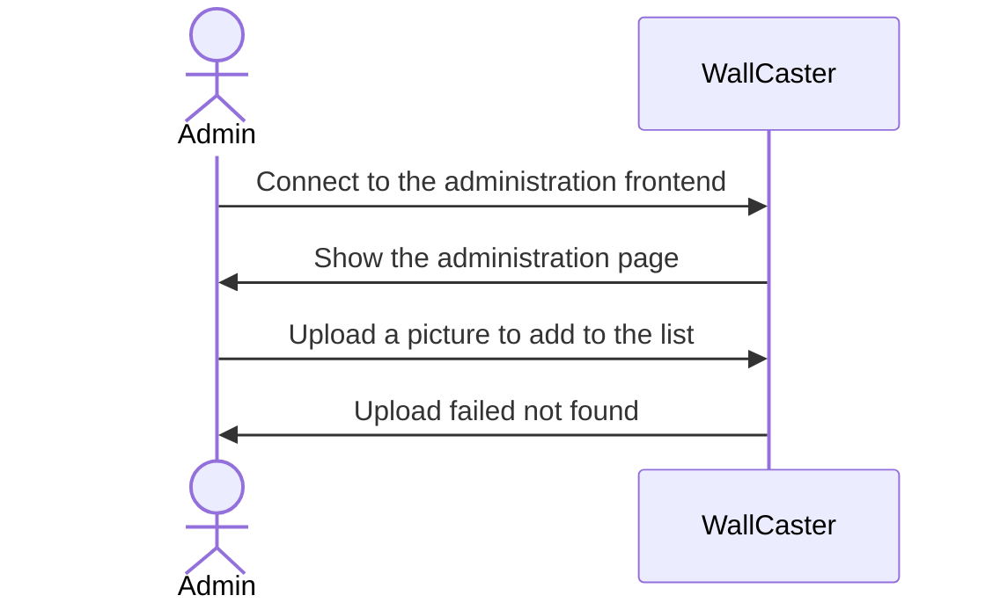

<br/>

### 2.2.2 - Extraire_Posts

> Set of scenarios corresponding to server requests to the APIs of the different social networks, in order to retrieve their content (or an error if the request is badly formulated)

- Scenario Nominatif

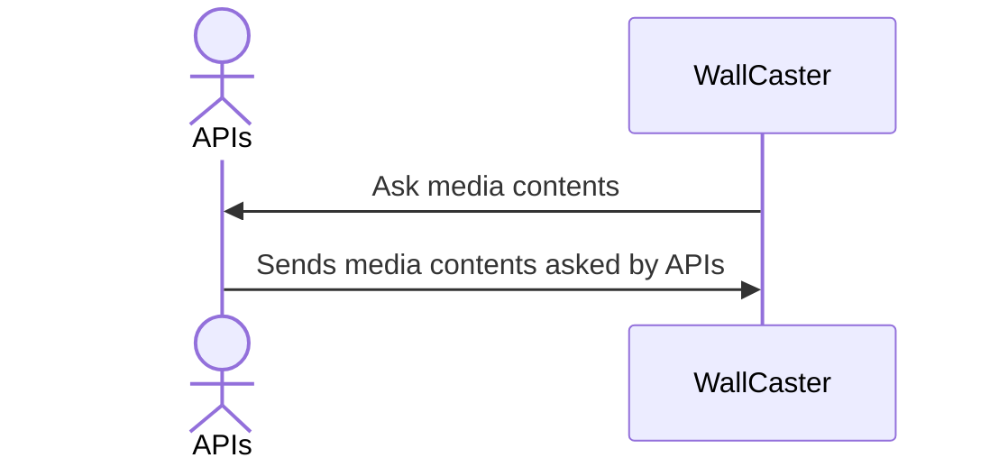

<br/>

- Scenario exception : authentification token expired

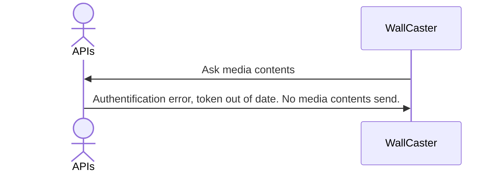

<br/>

- Scenario exception : no contents found

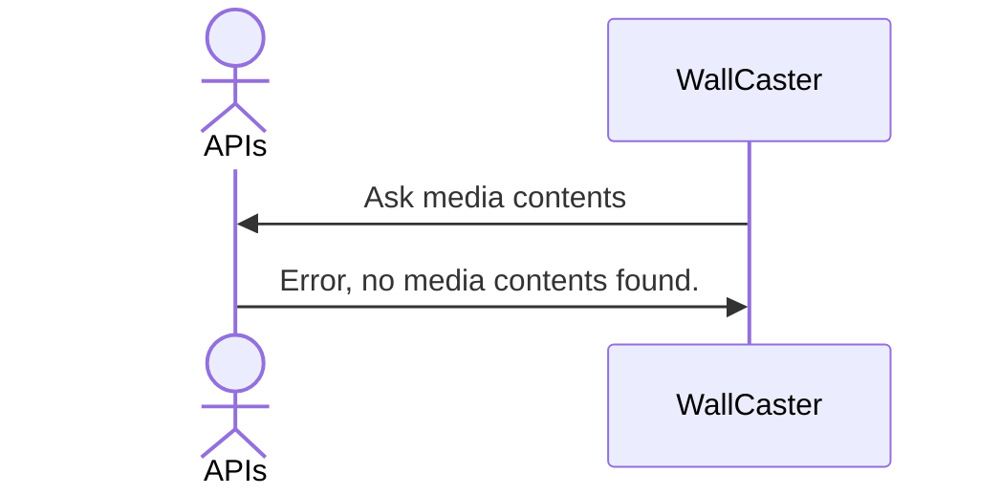

<br/>

- Scenario exception : connection error

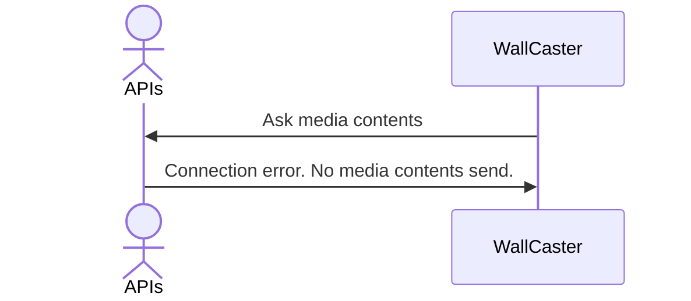

<br/>

### 2.2.3 - Filtrage des posts

> Set of scenarios corresponding to the filtering of the posts.

- Nominative Scenario

``mermaid
sequenceDiagram
  actor A as Admin
  participant W as WallCaster
  A ->> W : Connect to the administration frontend
  W ->> A : Display the administration page
  A ->> W : Configure filtering parameters
  A ->> W : Validate the configuration
  W ->> A: Indicates that the configuration has been saved
```

> This diagram represents the scenario in which the administrator configures the filtering parameters (keywords, time period, etc.). After validating, there is a confirmation from the system that the configuration has been saved.

> This diagram shows the scenario where the administrator configure the parameters of filtering (keyword, period of time, etc.). After validation, there is a configuration from the system that the configuration was registered.

- Exception Scenario

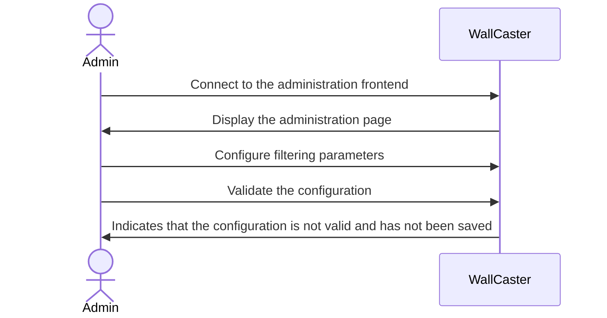

> This diagram represents a scenario similar to the previous one, but in which the administrator's configuration is not recognized by the system, and is not saved.

<br/>

### 2.2.4 - Sequence Supprimer post

- Nominative Scenario

Automatically delete posts based on sentiment analysis

mermaid
sequenceDiagram
  actor A as Admin
  participant W as WallCaster

  A ->> W : choose delete posts
  W ->> A : ask type of filtering to be done
  A ->> W : choose filtering
  W ->> A : Delete done
```
- Alternative Scenario
Manually delete posts that have escaped sentiment analysis 

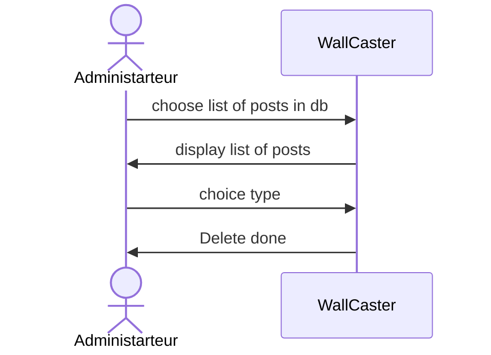

<br/>

### 2.2.5 - Change Filtre Diffusion

- Nominal scenario

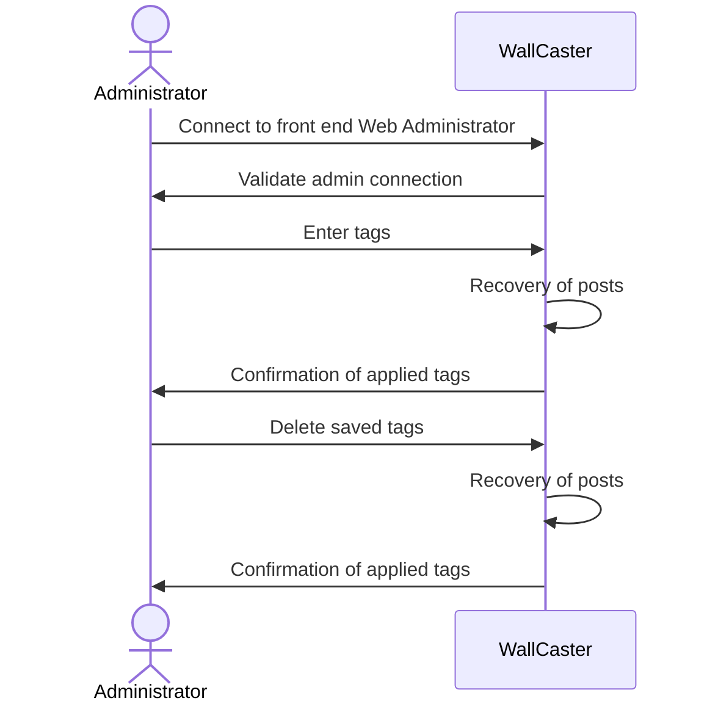

This first diagram shows the scenario where the administrator wants to enter tags in order to filter the posts after logging in to the web front end. The administrator can also ask the system to modify some tags or to delete them.

- Alternative Scenario : connection error on front-end

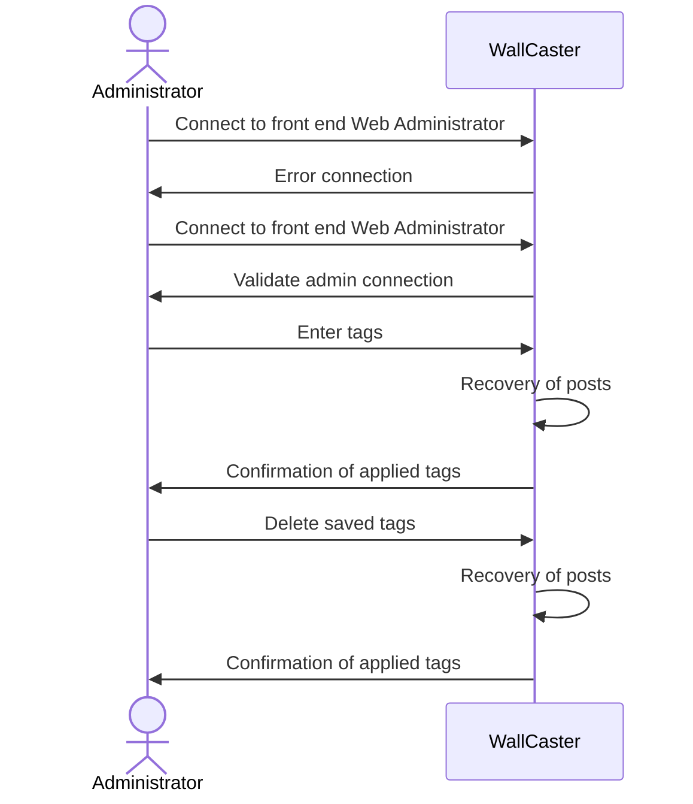

- Error scenario : connection error on server

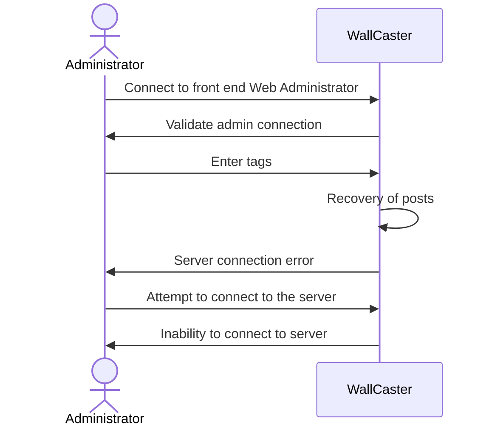
The error scenario considered is a server connection error involving an inability to apply or delete tags.


### 2.2.6 - Set-up RaspberryPi

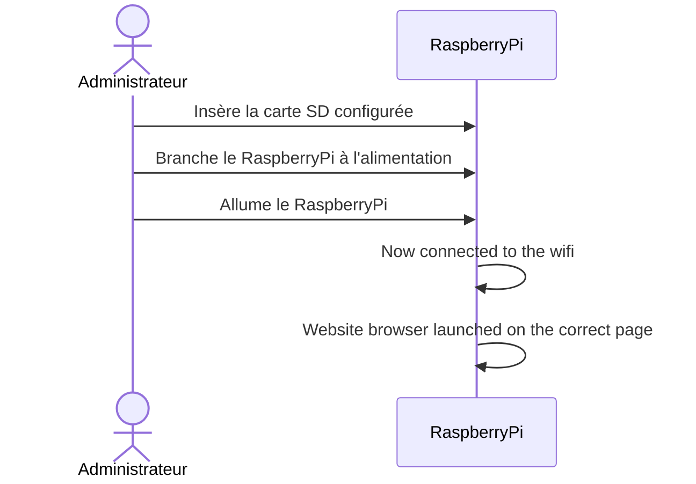

> This scenario describes the process of setting up the RaspberryPi. It may change depending on the final implementation of the RaspberryPi.

## 2.3 - User Story

### 2.3.1 - Manage photos

> The photographer give to the admin a list a pictures that he took. As an admin want to display them on the screens. To do that he upload the images on the server and now either a picture or a post can be displayed by the system.
Then, I want to remove one of the images. For that, he just need to remove it from the system.

### 2.3.2 - Extraire Posts

> The system want to send requests to the APIs and they answer it with the right contents.

### 2.3.3 - Filtrage des posts

> As an admin I can set parameters (keywords, ...) for the filter to block unwanted content

> As an admin I can manualy moderate content

### 2.3.4 - Sequence Supprimer post

> As an admin I can delete posts that have already been displayed

### 2.3.5 - Change Filtre Diffusion

> As an admin I can set parameters (keywords, date, ...) for the posts to be searched by the API and shown on the website


### 2.3.6 - Set-up RaspberryPi

> As an admin I can setup the raspberry pi to connect to the right wifi network so that it can access the website

<br/>


# 3 - Description of the ecosystem: presentation of the elements with which the system will have to integrate, the constraints to be respected


4 Social Media API (Twitter, LinkedIn, Facebook, Instagram) 
Our system will have to communicate with various social network APIs in order to retrieve the posts (texts and images) corresponding to a given keyword.

- Twitter API :
  - Constraints:
    - Authentication via a developer account

- LinkedIn API : 
  - Constraints:
    - Authentication via a developer account

- Graph API Instagram Search hastag included in the Facebook SDK:
  - Process : 
    - Create a Facebook application
    - Configure the application and the different permissions required to get an Access token
    - Instagram authentication
    - Requests to retrieve posts by #hashtag
  - Constraints:
    - Have a Facebook developer account 
    - Have an Instagram developer account

- Facebook Graph API:
  - Constraints:
    - Impossible to get the public Facebook feed via the Facebook SDK so find an alternative

- API to filter posts according to several criteria

- Raspberry PI:
  - Microcomputer allowing to display web content 
  - Each Raspberry PI is connected to a screen to display a specific content
  - Connection to all Raspberry PI corresponding to the screens of the conference.
  - Constraints: 
    - Have a WiFi connection

- Persistent server:
  - Hosted on IRISA's servers so that it can be accessed off campus.
  - Storage of the administration configuration
  - Storage of posts to be displayed
  - Constraints: 
    - Have a WiFi connection

<br/>

# 4 - Principe de solution : description externe de la solution proposée (le quoi, pas le comment)

Our solution consist of a software and a hardware part. 
The software part is a web application that will be used to configure the content to display dynamically.
The hardware part are multiples RaspberryPi devices connected to the monitors to display the selected content.

The content : 
- It consists of a slideshow of images and text (with a nice visualization) fetched from a social network (Twitter, Instagram, Facebook, LinkedIn, etc.)
- The content can be filtered by a set of rules (blacklist, whitelist, date range, number of monitor, allow image, sound video, video, audio, has explicit content, negative emotion, etc...)
- The content can be manually moderated by a human operator if needed.
- The content will be fetched according to a given query and sources and updated dynamically.
- If there is not enough content to display, allow user to select a set of images to display.