- [Rappel du besoin et critères de succès](#rappel-du-besoin-et-critères-de-succès)
  - [Specifications](#specifications)
  - [Critères de succès](#critères-de-succès)
- [Modèle du domaine métier : modèle UML des notions manipulées, relations et explications](#modèle-du-domaine-métier--modèle-uml-des-notions-manipulées-relations-et-explications)
  - [Use case diagram](#use-case-diagram)
  - [Diagrame de Séquence Système](#diagrame-de-séquence-système)
    - [Manage photos](#manage-photos)
      - [Scenario Nominatif](#scenario-nominatif)
      - [Scenario alternatif](#scenario-alternatif)
      - [Scenario exception : photo trop lourde](#scenario-exception--photo-trop-lourde)
      - [Scenario exception : erreur de connexion](#scenario-exception--erreur-de-connexion)
      - [Scenario exception : not found](#scenario-exception--not-found)
    - [Extraire\_Posts](#extraire_posts)
      - [Scenario Nominatif](#scenario-nominatif-1)
      - [Scenario exception : authentification token expired](#scenario-exception--authentification-token-expired)
      - [Scenario exception : no contents found](#scenario-exception--no-contents-found)
      - [Scenario exception : connection error](#scenario-exception--connection-error)
    - [Filtrage des posts](#filtrage-des-posts)
    - [Sequence Supprimer post](#sequence-supprimer-post)
      - [Scenario 1](#scenario-1)
      - [Scenario 2](#scenario-2)
  - [User Story](#user-story)
- [Description de l'écosystème : présentation des éléments avec lesquels le système va devoir s'intégrer, des contraintes à respecter](#description-de-lécosystème--présentation-des-éléments-avec-lesquels-le-système-va-devoir-sintégrer-des-contraintes-à-respecter)
      - [API Twitter :](#api-twitter-)
      - [API LinkedIn :](#api-linkedin-)
      - [Graph API Instagram Search hastag inclus dans le Facebook SDK:](#graph-api-instagram-search-hastag-inclus-dans-le-facebook-sdk)
      - [Graph API Facebook :](#graph-api-facebook-)
      - [API de filtrage des posts selon plusieurs critères](#api-de-filtrage-des-posts-selon-plusieurs-critères)
      - [Raspberry PI :](#raspberry-pi-)
      - [Serveur persistant :](#serveur-persistant-)
- [Principe de solution : description externe de la solution proposée (le quoi, pas le comment)](#principe-de-solution--description-externe-de-la-solution-proposée-le-quoi-pas-le-comment)

# Rappel du besoin et critères de succès

## Specifications

- Slideshow on interval of predefined images
- Configurable : 
  - Blacklist
  - Whitelist
  - Date range
  - Number monitor
  - Allow image, sound video, video, audio (attention au volume de l'audio et à la pertinence de sa diffusion)
  - Ne pas forcément diffuser le même contenu sur tous les écrans (paramètre random), à condition d'avoir suffisament de matériels visuels.
- Modération automatique mais aussi possibilité d'intervenir en second temps pour modérer manuellement, apply spam filtering (pour éviter l'ambiguïté des mots, filtrer le contenu inutile et les fausses conférences, usurpant l'identité des personnes pour les faire payer). Filtrage par mots-clés/hastags/dates. 
- Have a nice visualization. Eviter de diffuser trop peu d'images trop souvent et éviter la redondance. En début de conférence, s'il n'y a pas suffisament de matériel visuel, possibilité de prendre des posts sur les réseaux sociaux précédent la conférence (annonce des participants, rappels des thématiques).
- Collect content according to given query and sources, for instance : LinkedIn, Instagram, Facebook/Meta, Twitter). 
 
**Bonus** : Si la conférence est sur plusieurs jours, possibilité que le photographe officiel puisse diffuser les images prises la veille sur les écrans. 

## Critères de succès

- La specification est completement effectuée
- La deadline est respectée
- Le software fonctionne correctement (pas de bogues)
- Les critères de test sont validés
  
# Modèle du domaine métier : modèle UML des notions manipulées, relations et explications

## Use case diagram

## Diagrame de Séquence Système

### Manage photos

#### Scenario Nominatif

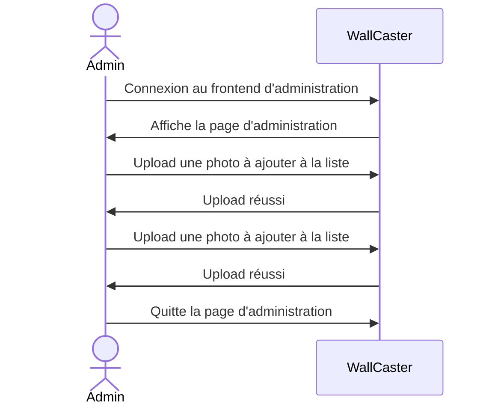

#### Scenario alternatif

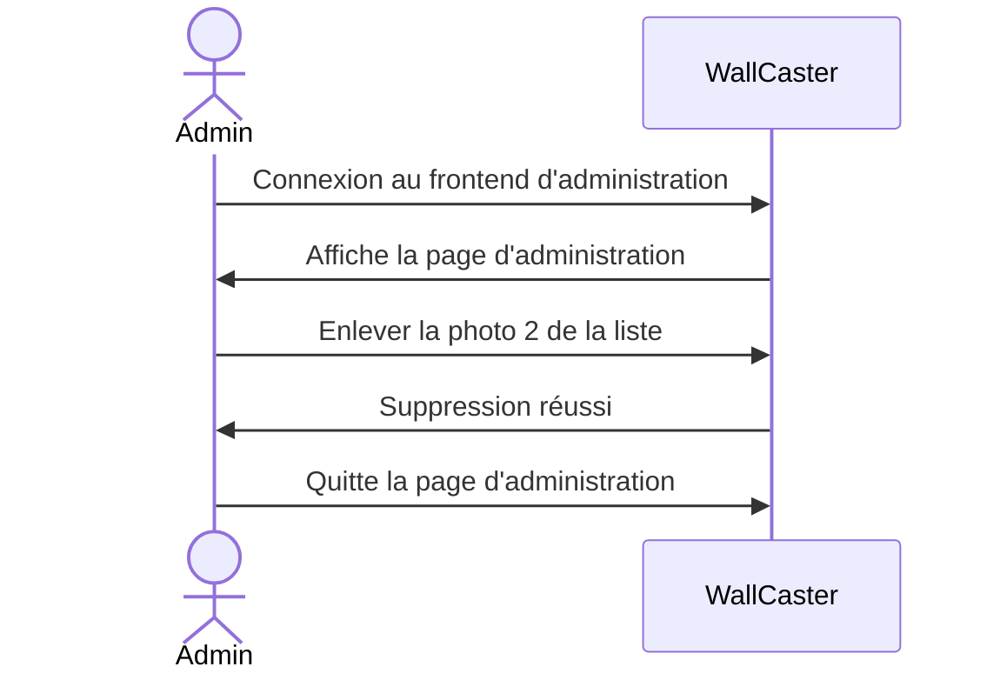

#### Scenario exception : photo trop lourde

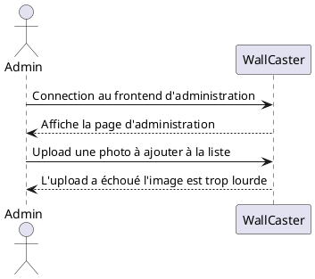

#### Scenario exception : erreur de connexion

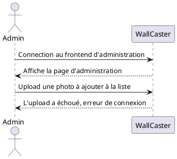
#### Scenario exception : not found

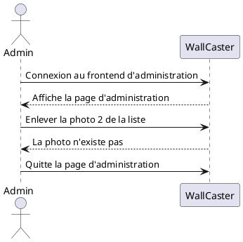

### Extraire_Posts

#### Scenario Nominatif

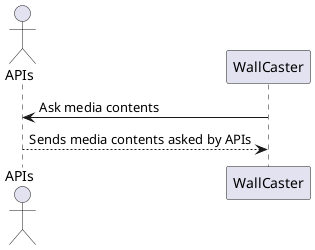

#### Scenario exception : authentification token expired

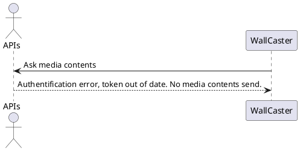

#### Scenario exception : no contents found

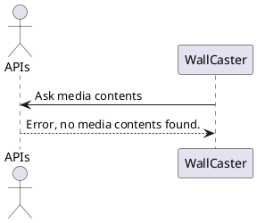

#### Scenario exception : connection error

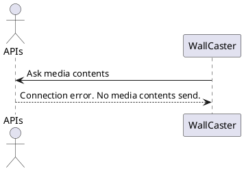
### Filtrage des posts

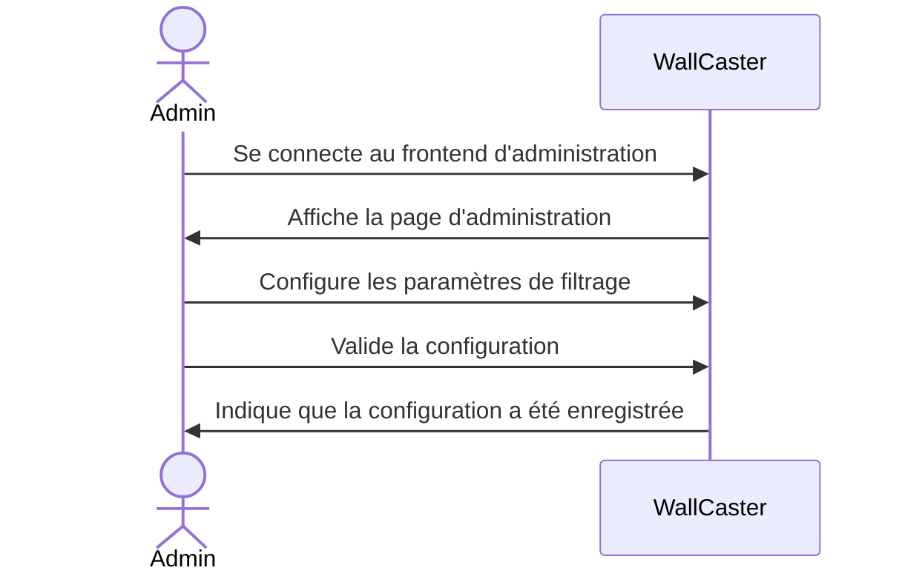

### Sequence Supprimer post

#### Scenario 1
Supprime automatiquement des posts à partir de l'analyse des sentiments
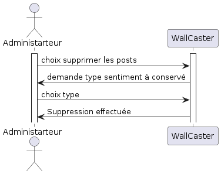

#### Scenario 2
Supprime manuellement les posts qui ont echappé l'analyse des sentiments 

## User Story

- As an admin I can setup the raspberry pi to connect to the right wifi network so that it can access the website

- As an admin I can set parameters (keywords, date, ...) for the posts to be searched by the API and shown on the website

- As an admin I can set parameters (keywords, ...) for the filter to block unwanted content

- As an admin I can manualy moderate content

- As an admin I can choose to show different content on different screens

# Description de l'écosystème : présentation des éléments avec lesquels le système va devoir s'intégrer, des contraintes à respecter
4 Social Media API (Twitter, LinkedIn, Facebook, Instagram) 
Notre système va devoir communiquer avec divers APIs de réseaux sociaux afin d'en récupérer les posts (textes et images) correpondants à un mot clé donné.

#### API Twitter :
  - Contraintes :
    - Authentification via un compte développeur

#### API LinkedIn : 
  - Contraintes :
    - Authentification via un compte développeur

#### Graph API Instagram Search hastag inclus dans le Facebook SDK:
  - Processus : 
    - Créer une application Facebook
    - Configurer l'application et les différentes permissions requises afin d'en récupérer un Access token
    - Authentification Instagram
    - Requêtes de récupération de posts par #hashtag
  - Contraintes :
    - Avoir un compte développeur Facebook 
    - Avoir un compte développeur Instagram

#### Graph API Facebook :
  - Contraintes :
    - Impossibilité de récupérer le feed public Facebook via le Facebook SDK donc trouver une alternative

#### API de filtrage des posts selon plusieurs critères

#### Raspberry PI :
  - Micro-ordinateur permettant d'afficher un contenu web 
  - Chaque Raspberry PI est relié à un écran afin d'y afficher un contenu spécifique
  - Connexion à tous les raspberry PI correspondant aux écrans de la conférence.
  - Contraintes : 
    - Avoir une connexion WiFi

#### Serveur persistant :
  - Hébergement sur les serveurs de l'IRISA afin qu'il puisse être accessible en dehors du campus.
  - Stockage de la configuration de l'administration
  - Stockage des posts à afficher
  - Contraintes : 
    - Avoir une connexion WiFi

# Principe de solution : description externe de la solution proposée (le quoi, pas le comment)

Our solution consist of a software and a hardware part. 
The software part is a web application that will be used to configure the content to display dynamically.
The hardware part are multiples RaspberryPi devices connected to the monitors to display the selected content.

The content : 
- It consists of a slideshow of images and text (with a nice visualization) fetched from a social network (Twitter, Instagram, Facebook, LinkedIn, etc.)
- The content can be filtered by a set of rules (blacklist, whitelist, date range, number of monitor, allow image, sound video, video, audio, has explicit content, negative emotion, etc...)
- The content can be manually moderated by a human operator if needed.
- The content will be fetched according to a given query and sources and updated dynamically.
- If there is not enough content to display, allow user to select a set of images to display.

<!-- --- TODO je sais pas trop ou mettre ça ---

-->