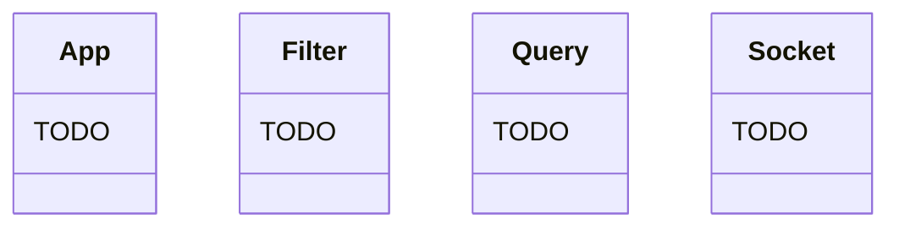
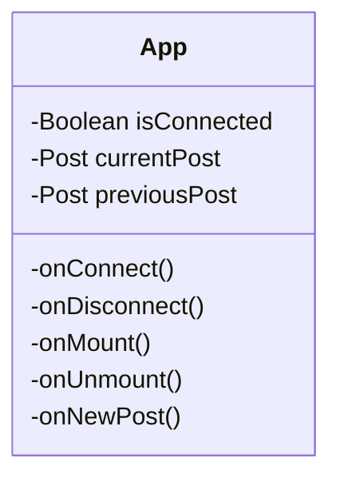
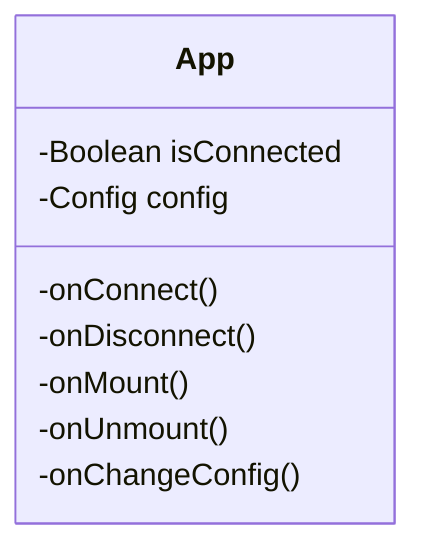

# Principe de mise en œuvre de la solution (comment)

[Excalidraw diagram architecture](https://excalidraw.com/#room=d3c68b5d868bf31c6725,rgPCEXYY3Snqm5Z6OaEvHQ)

# Règles d'architecture
# Modèle statique : organisation des packages, descriptions des classes principales et de leurs responsabilités

## Server Backend

## Frontend Clients

## Frontend Administration

# Modèle dynamique : flux des événements, nominal et sur erreur, démarrage et arrêt
# Explication de la prise en compte des contraintes d'analyse
# Cadre de production : outils de dev, de configuration et de livraison.

- Docker 
- Git / Github
- CI