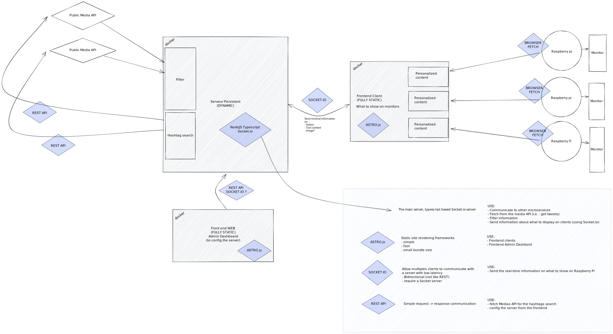
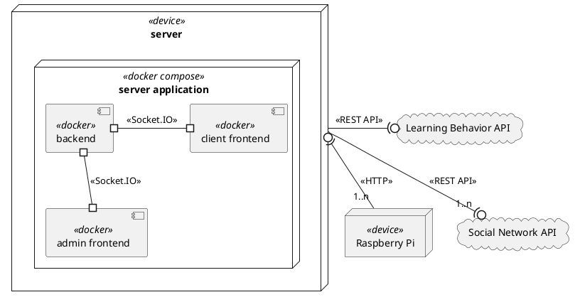
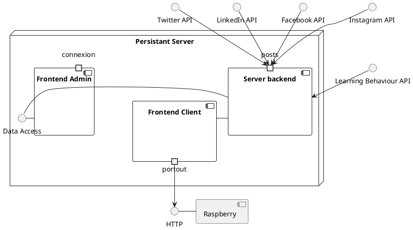
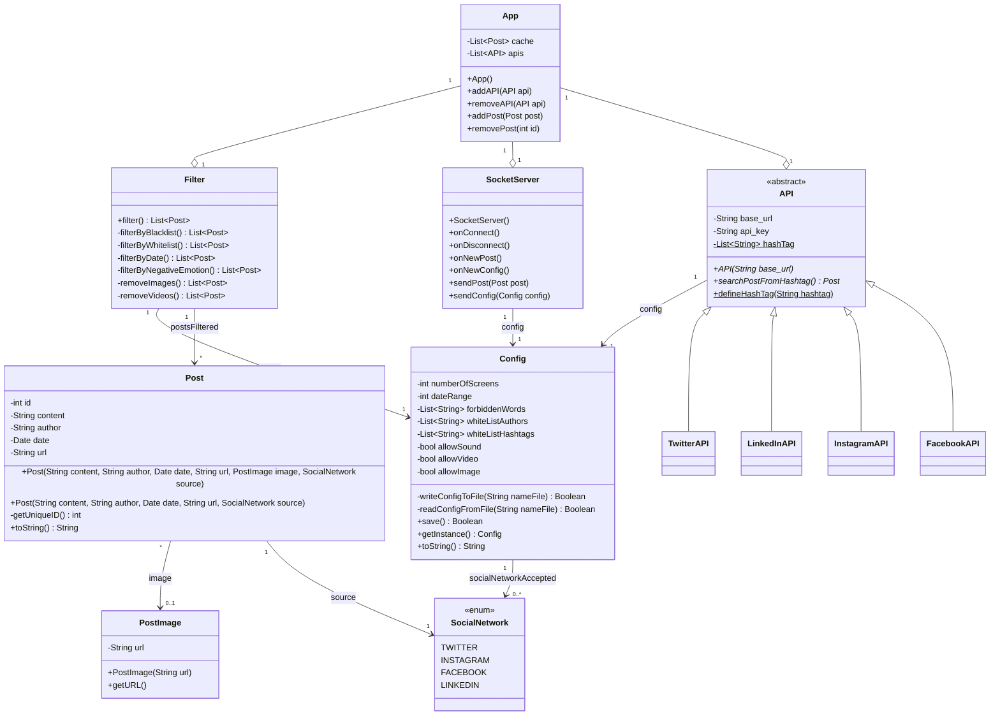
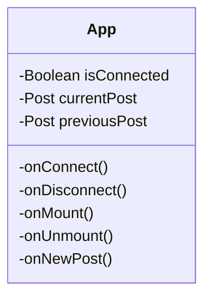
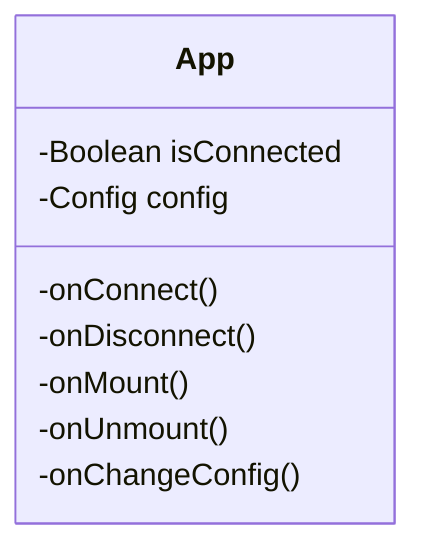

# Implementation principle of the solution (how)

<!-- en dessous le code plantuml pour générer le diagrame de déploiement -->

<!--

-->

# Architecture rules
# Static model : packages organization, main classes descriptions and their responsabilities

## Component Diagram

## Server Backend

## Frontend Clients

## Frontend Administration

# Dynamic model : events streams, nominal and error-related, startup and shutdown
# Explaination about analysis constrains consideration
# Production frame : development, configuration and deployment tools.

## Development tools

- Git / GitHub
- CI

DEVELOPMENT RULES :
- Naming conventions : [makecode.com/extensions/naming-conventions](https://makecode.com/extensions/naming-conventions)

## Configuration tools

## Deployment tools

- Docker 
