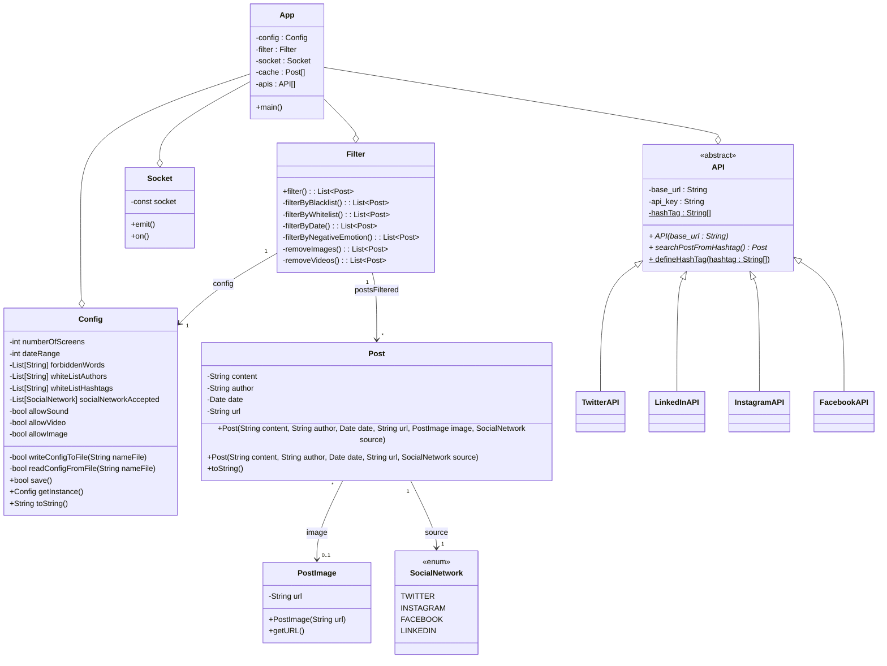
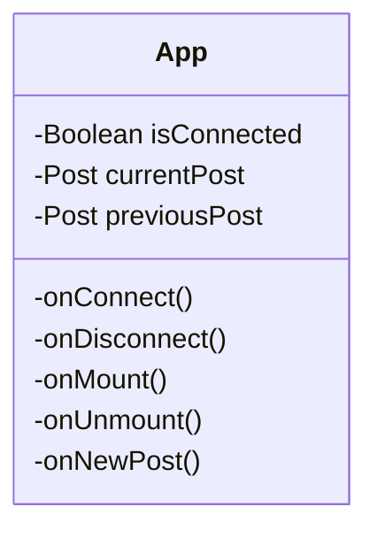
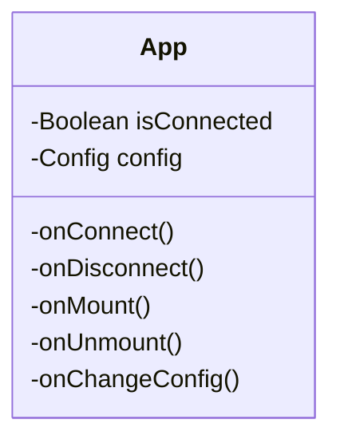

# Implementation principle of the solution (how)

# Architecture rules
# Static model : packages organization, main classes descriptions and their responsabilities

## Server Backend

## Frontend Clients

## Frontend Administration

# Dynamic model : events streams, nominal and error-related, startup and shutdown
# Explaination about analysis constrains consideration
# Production frame : development, configuration and deployment tools.

## Development tools

- Git / GitHub
- CI

## Configuration tools

## Deployment tools

- Docker 
