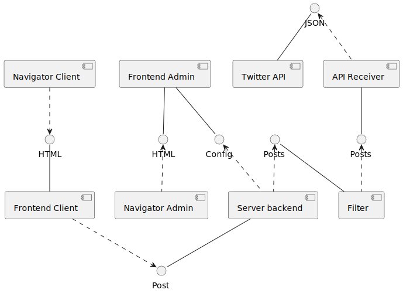
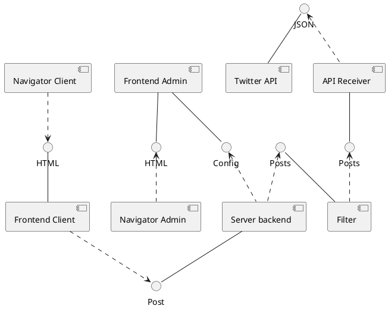
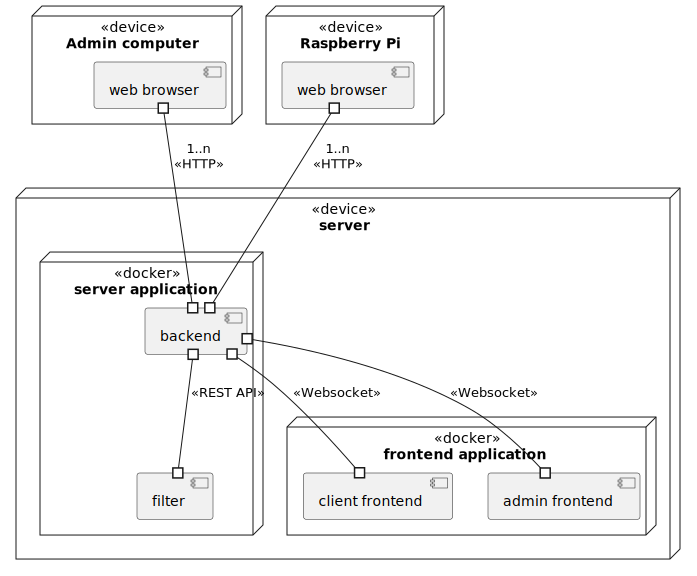
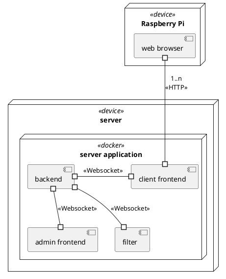
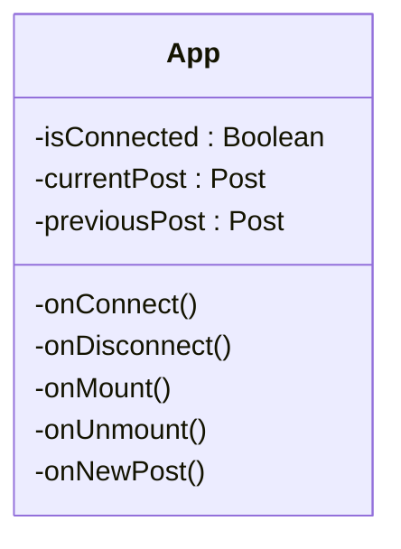
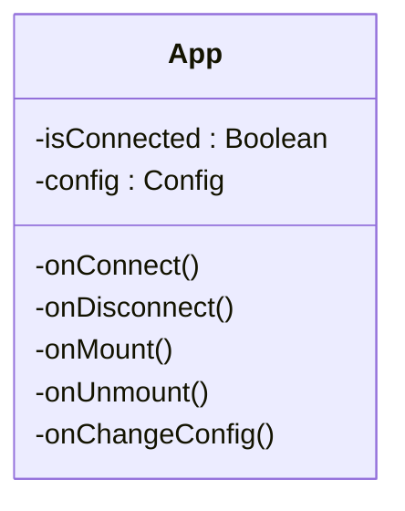

# Table of Contents

- [Table of Contents](#table-of-contents)
- [Static model : packages organization, main classes descriptions and their responsabilities](#static-model--packages-organization-main-classes-descriptions-and-their-responsabilities)
  - [Component Diagram](#component-diagram)
  - [Deployment Diagram](#deployment-diagram)
  - [Server Backend](#server-backend)
  - [Frontend Clients](#frontend-clients)
  - [Frontend Administration](#frontend-administration)
- [Dynamic model : events streams, nominal and error-related, startup and shutdown](#dynamic-model--events-streams-nominal-and-error-related-startup-and-shutdown)
- [Explaination about analysis constrains consideration](#explaination-about-analysis-constrains-consideration)
- [Production frame : development, configuration and deployment tools.](#production-frame--development-configuration-and-deployment-tools)
  - [Development tools](#development-tools)
    - [Versionning code tool](#versionning-code-tool)
    - [Continous development](#continous-development)
    - [Language](#language)
    - [Framework](#framework)
      - [Backend](#backend)
      - [Frontend](#frontend)
    - [Test tools](#test-tools)
  - [Deployment tools](#deployment-tools)
  - [Coloboratoin tools](#coloboratoin-tools)


# Static model : packages organization, main classes descriptions and their responsabilities

## Component Diagram

<!-- en dessous le code plantuml pour générer le diagrame de déploiement -->

<!-- 

-->

This component diagram shows us the different interactions between each component of our system. Indeed, our server is the central component since it communicates with the different interfaces.
Our backend server retrieves Posts items from the Filter component which retrieves them from the Receiver API. As for the API Receiver component, it retrieves the JSON files corresponding to the Twitter API posts.
Additionally, our client frontend fetches each Post through the backend server.
Finally, our frontend Admin brings the necessary configuration (Config) to the backend server.

## Deployment Diagram
<!-- en dessous le code plantuml pour générer le diagrame de déploiement -->

<!--

-->

The execution node "docker" correspond to a DockerCompose which allow to manage the different components present on the server in a container form.

## Server Backend


This diagram represents the UML diagram of the backend.
One of the class is called "Config" and represent all the parameter of the application. This class is a singleton because only one configuration is nessecary.
The class "Socket" allows to send informations to the back.

<!--
```mermaid
classDiagram


class App {
  -cache : List~Post~ 
  -apis : List~API~ 

  +App()
  +addAPI(API api)
  +removeAPI(API api)
  +addPost(Post post)
  +removePost(int id)
}

class Filter {
  <<abstract>>
  +Filter(Config config)
  +apply(List~Post~ posts) List~Post~
}
class BanWordsFilter {
  +BanWordsFilter(Config config)
  +apply(List~Post~ posts) List~Post~
}
class NegativeFilter {
  +NegativeFilter(Config config)
  +apply(List~Post~ posts) List~Post~
}

class SocketServer {
  +SocketServer()
  +onConnect()
  +onDisconnect()
  +onNewPost()
  +onNewConfig()
  +sendPost(Post post)
  +sendConfig(Config config)
}

class Config {
  -numberOfScreens : int
  -dateRange : int
  -forbiddenWords : List~String~
  -whiteListAuthors : List~String~ 
  -whiteListHashtags : List~String~ 
  -allowSound : bool 
  -allowVideo : bool 
  -allowImage : bool 

  +writeConfigToFile(fileName : string) : void
  +readConfigFromFile(fileName : string)) : void
  +toString() String
}

class Post {
  -id : int 
  -content : String 
  -author : String 
  -date : Date 
  -url : String 
  +Post(String content, String author, Date date, String url, PostImage image, SocialNetwork source)
  +Post(String content, String author, Date date, String url, SocialNetwork source)
  -getUniqueID() int
  +toString() String
}

class API {
  <<abstract>>
  -base_url : String 
  -api_key : String 
  -hashTag$ : List~String~ 
  +API(String base_url)*
  +searchPostFromHashtag()* Post
  +defineHashTag(String hashtag)$
}

class PostImage {
  -url : String 
  +PostImage(String url)
  +getURL()
}

class SocialNetwork {
  <<enum>>
  TWITTER
  INSTAGRAM
  FACEBOOK
  LINKEDIN
}

class TwitterAPI {
  
}

class LinkedInAPI {
  
}

class InstagramAPI {
  
}

class FacebookAPI {
   
}

App "1" --o "*" Filter
App "1" --o "1" SocketServer
App "1" --o "1" API
App "1" - -> "*" Post : postsFiltered
Filter "1" - -> "1" Config : config
Filter <|-- BanWordsFilter 
Filter <|-- NegativeFilter

Post "*" - -> "0..1" PostImage : image
Config "1" - -> "0..*" SocialNetwork : socialNetworkAccepted
SocketServer "1" - -> "1" Config : config
API "1" - -> "1" Config : config
Post "1" - -> "1" SocialNetwork : source
API <|-- TwitterAPI
API <|-- LinkedInAPI
API <|-- InstagramAPI
API <|-- FacebookAPI


``` 
-->


## Frontend Clients



## Frontend Administration



# Dynamic model : events streams, nominal and error-related, startup and shutdown


The sequence diagram above shows how the different objets and classes communic to refresh the posts store and send them to the backend. That is represented thank's to two parrallel actions : Methods "run()" and "updateCache()".

# Explaination about analysis constrains consideration

What we did that fit the constrains :

- We have a `Filter` Interface and its child classes to filter posts

- The `Post` class  has a Image class to store a picture

- There is the possibility to request different APIs thanks to the `API` class and its child classes

- An interface for the backend will be developed to allow the admin to manage the configuration (Tags/hashtags, authors, date range, etc) and the content that will be send to the frontend.

- The posts will be send to the front thanks to the `Socket` class.

- The project is dockerized and can be deployed on a dedicated server to be used by multiple clients.

- The frontend client is a web application that can be used on any device that has a browser (PC, tablet, smartphone, raspberry pi, etc).


# Production frame : development, configuration and deployment tools.

## Development tools

### Versionning code tool

- Git (GitHub)

### Continous development

- Github Actions 
- DockerCompose

### Language

- TypeScript

### Framework 

#### Backend

- NodeJS

#### Frontend

- Astro (NodeJS)
- React

### Test tools

- Static test : 
  - ESLint 
  - Code Review

- Dynamic test (unit testing & integration test) : 
  - Jest

## Deployment tools

- Docker / Docker Compose
- Naming conventions :
  - [Microsoft TypeScript conventions](https://makecode.com/extensions/naming-conventions)

## Coloboratoin tools

- Github kanban (for backlogs)
- Discord
