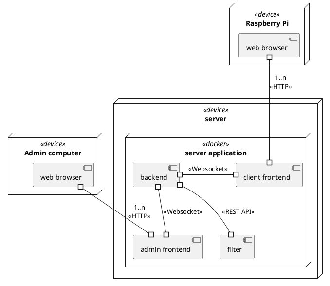
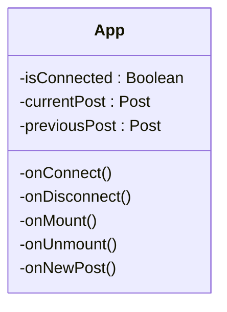
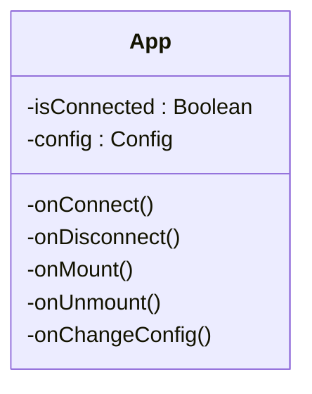

# Table of Contents

- [Table of Contents](#table-of-contents)
- [Static model : packages organization, main classes descriptions and their responsabilities](#static-model--packages-organization-main-classes-descriptions-and-their-responsabilities)
  - [Component Diagram](#component-diagram)
  - [Deployment Diagram](#deployment-diagram)
  - [Server Backend](#server-backend)
  - [Frontend Clients](#frontend-clients)
  - [Frontend Administration](#frontend-administration)
- [Dynamic model : events streams, nominal and error-related, startup and shutdown](#dynamic-model--events-streams-nominal-and-error-related-startup-and-shutdown)
- [Explaination about analysis constrains consideration](#explaination-about-analysis-constrains-consideration)
- [Production frame : development, configuration and deployment tools.](#production-frame--development-configuration-and-deployment-tools)
  - [Development tools](#development-tools)
    - [Versionning code tool](#versionning-code-tool)
    - [Continous development](#continous-development)
    - [Language](#language)
    - [Framework](#framework)
      - [Backend](#backend)
      - [Frontend](#frontend)
    - [Test tools](#test-tools)
  - [Deployment tools](#deployment-tools)
  - [Coloboration tools](#coloboration-tools)


# Static model : packages organization, main classes descriptions and their responsabilities

## Component Diagram

<!-- en dessous le code plantuml pour générer le diagrame de déploiement -->


<!-- ```plantuml
@startuml component
[Server backend] as SB
[API Receiver] as API
[Filter] as F
[Navigator Client] as NC
[Frontend Admin] as FA
[Frontend Client] as FC
[Navigator Admin] as NA
[Twitter API] as TW
() "Post" as POST
() "Post" as POSTS1
() "Post" as POSTS2
() "Config" as CONFIG
() "HTML" as HTML1
() "HTML" as HTML2
() "JSON" as JSON

POSTS2 <.. F
F -- POSTS2
SB -- POSTS2
SB ..> POSTS2
CONFIG <.. SB
API -- POSTS1
SB <.. POSTS1
JSON <.. API
TW -- JSON
FA -- CONFIG
SB -- POST
FC ..> POST


NC ..> HTML2
HTML2 -- FC
HTML1 <.. NA 
FA -- HTML1


@enduml
``` -->


This component diagram shows us the different interactions between each component of our system. Indeed, our server is the central component since it communicates with the different interfaces.
Our backend server retrieves Posts items from the Filter component which retrieves them from the Receiver API. As for the API Receiver component, it retrieves the JSON files corresponding to the Twitter API posts.
Additionally, our client frontend fetches each Post through the backend server.
Finally, our frontend Admin brings the necessary configuration (Config) to the backend server.

## Deployment Diagram

<!-- en dessous le code plantuml pour générer le diagrame de déploiement -->

<!-- 


During development, the architecture within the backend underwent some changes to be better adapted to the technical constraints encountered during development. Indeed, the Filter class became a simple function filterPost(post: Post) within the App class. This function makes a request to our Flask microservice filter-processor, which performs all the filters on the posts (banned_words, nsfw, sentiment).

## Frontend Clients



## Frontend Administration



# Dynamic model : events streams, nominal and error-related, startup and shutdown


The sequence diagram above shows how the different objets and classes communic to refresh the posts store and send them to the backend. That is represented thank's to two parrallel actions : Methods "run()" and "updateCache()".

# Explaination about analysis constrains consideration

What we did that fit the constrains :

- We have a `Filter` Interface and its child classes to filter posts

- The `Post` class  has a Image class to store a picture

- There is the possibility to request different APIs thanks to the `API` class and its child classes

- An interface for the backend will be developed to allow the admin to manage the configuration (Tags/hashtags, authors, date range, etc) and the content that will be send to the frontend.

- The posts will be send to the front thanks to the `Socket` class.

- The project is dockerized and can be deployed on a dedicated server to be used by multiple clients.

- The frontend client is a web application that can be used on any device that has a browser (PC, tablet, smartphone, raspberry pi, etc).


# Production frame : development, configuration and deployment tools.

## Development tools

### Versionning code tool
Source code management tools, also known as version control or revision control systems, are used to track changes to application code and allow teams to collaborate on the same application at the same time. This is some of the most used

- Git : It is one of the best version control tools that is available in the present market.
- CVS : It is yet another most popular revision control system. CVS has been the tool of choice for a long time.
- SVN : Apache Subversion, abbreviated as SVN aims at to be a best-matched successor to the widely used CVS tool that we just discussed above.
- etc.

For our project we have chosen to use **Git** because Super-fast and efficient performance, Cross-platform, code changes can be very easily and clearly tracked and easily maintainable and robust.


### Continous development
Continuous development, also known as continuous integration and continuous delivery (CI/CD), is a software development practice that aims to deliver software updates more frequently and with higher quality. It involves a continuous process of building, testing, and deploying software changes.
ome popular examples include:
- GitLab : A web-based Git repository manager that includes built-in continuous integration and deployment features.
- Kubernetes: An open-source container orchestration platform that automates the deployment, scaling, and management of containerized applications.
- Travis CI: A cloud-based continuous integration service that is widely used for building and testing software projects.
- etc.

For our project we have chosen to use **Docker Compose** because our project requires multiple services and Docker Compose can be a good choice because it allows we to define and manage all those services in a single file, which makes it easier to maintain and deploy our application. Additionally, Docker Compose can help we ensure that our application runs consistently across different environments, as it allows we to define the configuration of each service and specify dependencies between services.

### Language

- TypeScript (Backend, Frontend client and Frontend Admin) : We chose to work with NodeJS so TypeScript was mandatory.
- Python (Filters) : Python was obvious choice for this tack, beacause the major part of filters with artificial intelligence are written in Python.

### Framework 

#### Backend

- NodeJS : It is a standart for backend project, there is a lot of documentation and libraries available. Also, we all knew before starting the project.
- Flask (Python) for the Rest API : It is a micro-framework for Python, it is very simple to use and create a Rest API with it. Furthermore, it is very light and fast.

#### Frontend

- Astro (NodeJS) : For its simplicity as a render framework. It will be used to generate static HTML frontend pages.
- React : Used for interactive components (like the admin panel)

### Test tools

- Static test : 
  - ESLint : It is included by default in our code editor (VSCode).
  - Code Review 

- Dynamic test (unit testing & integration test) : 
  - Jest : Jest is the leader for testing in JavaScript.

## Deployment tools

- Docker / Docker Compose : Docker is a standart for containerization.
- Naming conventions :
  - [Microsoft TypeScript conventions](https://makecode.com/extensions/naming-conventions)

## Coloboration tools

- Github Kanban (for backlogs)
- Discord
