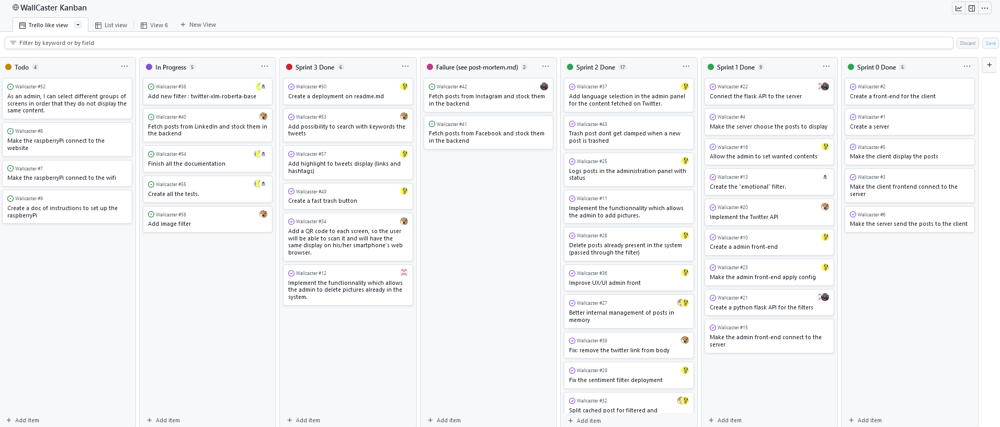

# Reminder of needs and main elements of the solution

Our solution consists of a software and a hardware component. The software component is a web application that will be used to dynamically configure the content to be displayed. The hardware component consists of multiple Raspberry Pi devices that are connected to the monitors to display the selected content.

From a software perspective, we have the following services:

- Backend server that retrieves posts from different social networks by applying behavioral filters and banned words filters.
- Frontend client that displays posts on different screens linked to a Raspberry Pi.
- Frontend administrator that provides the configuration that the backend must use.

# Estimation (planning, resources) and description of project progress (approach, milestones, tools, meetings)

For the progress of the project, we are using the agile project management method with a Kanban board (accessible via GitHub) to define tasks for the current sprint. Additionally, a daily meeting is held at the start of each work session to discuss the progress of tasks. Finally, at the end of each work session, another meeting is held to assign any tasks that can be progressed before the next lab session.

# Description of roles and responsibilities

## Week 1 (29/11/2022)

- Kilian: Twitter API monitoring
- Yanis: Raspberry Pi monitoring
- Louis-Gabriel: LinkedIn API monitoring
- Bastien: Facebook/Instagram API monitoring
- Kouame: AI filtering monitoring
- Cody: Technological monitoring

## Week 2 (06/12/2022)

Analysis and architecture documents:

- Kilian: Static model (visual paradigm), dynamic model, production framework
- Yanis: Business domain model
- Louis-Gabriel: Need reminder, system sequence diagram "Extract POST API"
- Bastien: Ecosystem description
- Kouame: Success criteria, system sequence diagram "Delete POST"
- Cody: Solution principle

## Week 3 (13/12/2022)

To be completed!

## "Bonus" day (05/01/2023)

Oral presentation preparation:

- Kilian: Finalizing diagram corrections and preparing slides
- Yanis: Document correction, Dockerization of the project for a live demo during the presentation, slides
- Louis-Gabriel: Document correction, slide preparation, and introduction writing
- Bastien: Document correction and slide preparation
- Kouame: Slide preparation
- Cody: Dockerization and deployment of different containers, slide preparation

## Week 4 (06/01/2023)

Oral presentation

## Week 5 (31/01/2023)

- Kilian: Twitter API integration
- Louis-Gabriel: Python filter creation, initial research, Flask tutorial
- Bastien: Python filter creation, initial research, Flask tutorial
- Kouame: Research, model training
- Cody: Frontend administration

We have used the tool GitHub Kanban to assign tasks at the beginning of each sprint. Here is a quick screenshot of what it looks like :

If you wish to have a closer look at it, [it is available on GitHub](https://github.com/orgs/WallCaster/projects/1/views/1).

This tool also helped us to check which tasks remained. It was often completed with new goals because our products owners had some new or more precise ideas.

# Project management (schedule monitoring, meeting minutes...)

## Meeting minutes

### 29/11/2022 with Zoltan MIKLOS

Filtering: ambiguity issue with words
Combining existing tools and adapting them.
Transfer Learning (retraining existing model)
Where to place the model? (frontend or backend)
Which accounts to monitor?
Filtering out irrelevant content and fakes (false conferences that impersonate people to make them pay)
Multiple layers of filtering (manual (moderator) and automatic). Based on keywords.

### 06/12/2022 with Benoît COMBEMALE

Objective of the day: sprint 0, document analysis in the morning, architecture document in the afternoon.
Setting up, choosing development tools, project management, library choices.
Appointing a scrum master to ensure everyone knows what to do at each moment.
If there are any questions about filtering, consult Z. Miklos.

### 13/12/2022 with Benoît COMBEMALE (morning)

Create use case diagram under specific cases.
Publish/subscribe mode: maintaining a client list permanently => a bit overkill according to Benoît Combemale.
Redo diagram with UML standard for architecture document, calculations in the client or server?
Component diagram and deployment diagram.
Client directly on the Raspberry Pi?
Place the frontend in the server?
The backend exposes a web page.
Create a docker-compose at the end.
For user stories:
Change filter diffusion: add a user story to add banned words
Set up Raspberry Pi: redo as "As an admin, I want to convert the client to the server."
Manage photos: does the photographer have a separate role or do they give their photos to the admin who manages everything, in which case they disappear?
Extract posts: redo from the user's perspective, what is marked is an implicit task of a user story
Post filtering: provide more details, especially regarding the input of the neural network...

Should banned words not be learned by the neural network, as it could be time-consuming and tedious for the admin to create the entire dictionary?

For filtering, not necessarily for the first prototype, but check if there are already pre-trained models for filtering explicit content.

### 13/12/2022 with Benoît COMBEMALE and Johann BOURCIER (afternoon)

Review component and deployment diagrams.
Note: REST is stateless. Use RESTful or change the API.
Component diagram: list the methods used for connection between two components.

### January 2023

The beginning of the month was dedicated to the oral training and presentation **(01/06/2023)**. Then some rest dedicated to the end of the semester.

### 01/02/2023

No meeting with our project owners.

### 07/02/2023 with Johann BOURCIER

Do not use the term "prototype," but "product," as it is the final version with limited functionalities. Test each implemented feature at every sprint. Be precise about the expected functionalities as they will be reviewed at the sprint review. Define the end date of the sprint (imperatively), no matter what happens. The goal is to be able to evaluate progress and manage the project well. Note that tasks (development) are not equal to functionalities (client).

### 14/02/2023 with Johann BOURCIER

Today is the sprint review meeting:

- Demo
- Retrospective (what worked, what didn't, actions to be taken within the team) to identify two or three actions
- Planning for the next sprint (send objectives via email)
- Define the end date for sprint 2.

Be sure to carefully think through user stories in detail to be able to connect multiple screens (in terms of user panel).

### 27/02/2023 with Benoît COMBEMALE and Johann BOURCIER

Start of sprint 2:

- Small demonstration with our teachers and some additional functionalities (in progress of preparation)
- Resolve issue with hashtag ict4s (doesn't recognize users?)

### 07/03/2023 with Benoît COMBEMALE and Romain LEFEUVRE

Add a new user story specifying the ability for the photographer to upload photos to the server. They should be able to use a USB key or send them from a remote server. However, the interface for them should be simple and the action should be quick (as they may not be computer-savvy). Discuss options for storing our system on an IRISA server or an ISTIC server/virtual machine. In either case, Docker should be used, and a comprehensive README should be provided to facilitate installation. If using an ISTIC virtual machine, consider opening ports and allowing external access with DSI approval. Raspberry Pis have been ordered, expected delivery by the end of the month.

### 14/03/2023 with Benoît COMBEMALE

New bonus feature (in case the sprint finishes too early): Add a QR code to the screens connected to the Raspberry Pis for users/viewers to scan, which would display the same content on their phones. Add language selection for desired tweets in the admin panel. Fix bug with hashtag "ict4s". Clarify how the "sentiment" filter works: Is it a pre-trained model or does it use its own data? It may be worth discussing with Zoltan MIKLOS to ensure the methodology being used is correct.

As the sprint is expected to finish early (two weeks ahead of schedule), during the retrospective, it's important to reflect on the factors that led to this phenomenon (possible overestimation) in order to improve the next sprint's execution.

### 21/03/2023 with Benoît COMBEMALE

- Develop an algorithm to determine the proportion of tweets versus pictures to be streamed, taking into account the contents of the cache.
- Ensure that the demo with the Twitter hashtag is functional by next week, before the end of the sprint.

### 28/03/2023 with Benoît COMBEMALE

- Explore options for intersecting Twitter searches, hashtags, and mentions to gather maximum content.
- Review URLs at the end of tweets.
- Add a delete icon for each post in the queue.
- Reorganize dates to create a list ranging from 0 to 7.
- Create configuration and deployment files for Romain to conduct internal testing quickly.
- Verify if the system restarts correctly in case of a breakdown.

### 11/04/2023 with Benoît COMBEMALE

- Sprint ends on 18/04/2023.
- Schedule a discussion with Romain LEFEUVRE (romain.lefeuvre@inria.fr) regarding the readme and the setup of Raspberry Pi.

### 18/04/2023 with Hélène FEUILLATRE, Zoltan MIKLOS

- Be careful, we must have a demonstration of the final product during the oral presentation (within 15 minutes). 
- We can have a small video just in case (demo effect about the NSFW filter for example).
- During the presentation, we must be persuasive (like if we sell the product).
- The ordered Raspberry Pi have not be received, so we will use ancient ones without Wifi.

# Description and Management of Requirements